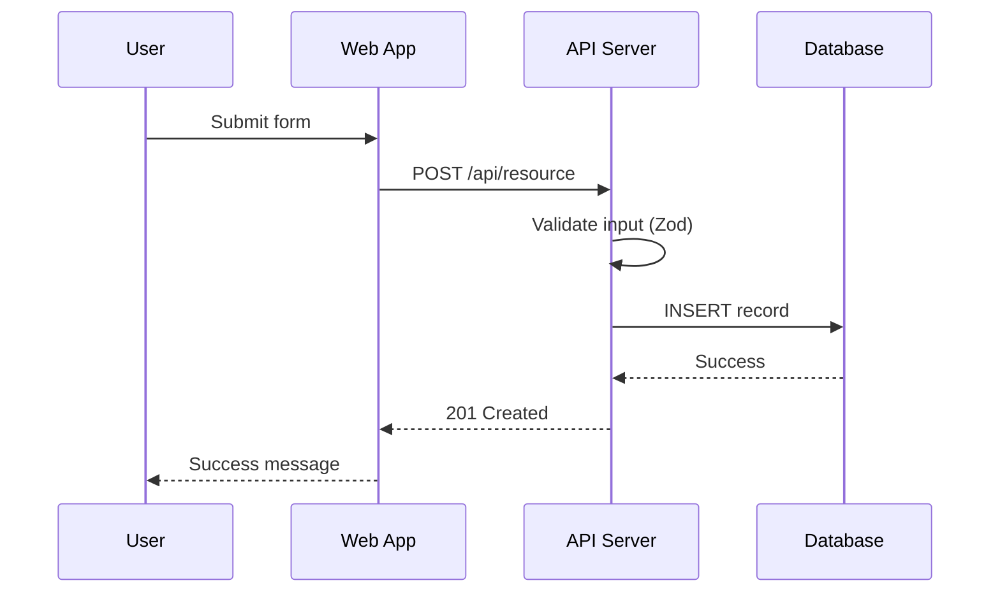

# Arc42 Architecture Documentation Template (v9.0)

## Complete Template

```markdown
# Architecture Documentation: [System Name]
**Version**: [X.Y]
**Authors**: [Names]
**Date**: YYYY-MM-DD
**Status**: Draft | In Review | Approved

---

## 1. Introduction and Goals

### 1.1 Requirements Overview
[Brief description of the key functional requirements driving architecture decisions]

### 1.2 Quality Goals
| Priority | Quality Goal | Scenario |
|----------|-------------|----------|
| 1 | [e.g., Performance] | [Measurable scenario] |
| 2 | [e.g., Security] | [Measurable scenario] |
| 3 | [e.g., Maintainability] | [Measurable scenario] |

### 1.3 Stakeholders
| Role | Expectations |
|------|-------------|
| [Role] | [What they need from the architecture] |

---

## 2. Constraints

### 2.1 Technical Constraints
| Constraint | Background |
|-----------|-----------|
| [e.g., Must run on Linux] | [Why] |

### 2.2 Organizational Constraints
| Constraint | Background |
|-----------|-----------|
| [e.g., Team of 3 developers] | [Impact on architecture] |

### 2.3 Conventions
| Convention | Background |
|-----------|-----------|
| [e.g., RESTful API design] | [Standard followed] |

---

## 3. Context and Scope

### 3.1 Business Context
[C4 System Context diagram - shows users and external systems]

| Communication Partner | Input | Output |
|----------------------|-------|--------|
| [User/System] | [What they send] | [What they receive] |

### 3.2 Technical Context
[Network topology, protocols, ports, authentication between systems]

---

## 4. Solution Strategy

| Quality Goal | Approach | Details |
|-------------|----------|---------|
| [Goal] | [Architecture tactic] | [How implemented] |

### Technology Decisions Summary
| Decision Area | Choice | Rationale |
|--------------|--------|-----------|
| Runtime | [e.g., Node.js 22] | [Why] |
| Framework | [e.g., Fastify] | [Why] |
| Database | [e.g., PostgreSQL 16] | [Why] |
| ORM | [e.g., Drizzle] | [Why] |
| Validation | [e.g., Zod v4] | [Why] |

---

## 5. Building Block View

### 5.1 Level 1: Overall System
[C4 Container diagram]

| Container | Technology | Responsibility |
|-----------|-----------|---------------|
| [Web App] | [React/Next.js] | [UI rendering] |
| [API Server] | [Node.js/Fastify] | [Business logic, API] |
| [Database] | [PostgreSQL] | [Data persistence] |
| [Message Queue] | [Redis/Kafka] | [Async processing] |

### 5.2 Level 2: [Container Name] Components
[C4 Component diagram for complex containers]

| Component | Responsibility |
|-----------|---------------|
| [Router] | [HTTP routing] |
| [Auth Service] | [Authentication/authorization] |
| [User Service] | [User management logic] |

---

## 6. Runtime View

### 6.1 [Critical Flow Name]
[Sequence diagram showing the runtime interaction]



---

## 7. Deployment View

### 7.1 Infrastructure Topology
[Deployment diagram showing environments]

### 7.2 Environment Matrix
| Environment | Purpose | Infrastructure | URL Pattern |
|------------|---------|---------------|-------------|
| Development | Local development | Docker Compose | localhost:3000 |
| Staging | Pre-production testing | [Cloud provider] | staging.example.com |
| Production | Live users | [Cloud provider] | example.com |

---

## 8. Crosscutting Concepts

### 8.1 Authentication and Authorization
[Auth flow, token strategy, RBAC/ABAC model]

### 8.2 Error Handling
[Error response format (RFC 7807), error codes, logging strategy]

### 8.3 Logging and Observability
[OpenTelemetry setup, log format, trace propagation, metric collection]

### 8.4 Configuration Management
[Environment variable strategy, secrets management, validation]

### 8.5 Caching Strategy
[Cache layers, invalidation strategy, TTLs]

### 8.6 Internationalization
[i18n approach if applicable]

---

## 9. Architecture Decisions

| ADR | Title | Status | Date |
|-----|-------|--------|------|
| ADR-001 | [Architecture style selection] | Accepted | YYYY-MM-DD |
| ADR-002 | [Database selection] | Accepted | YYYY-MM-DD |
| ADR-003 | [API protocol selection] | Accepted | YYYY-MM-DD |

(Full ADRs maintained as separate documents)

---

## 10. Quality Requirements

### Quality Tree
| Quality Attribute | Sub-Attribute | Scenario | Architecture Tactic |
|------------------|--------------|---------|-------------------|
| Performance | Latency | API < 200ms p95 | Connection pooling, caching |
| Reliability | Availability | 99.9% uptime | Health checks, auto-scaling |
| Security | Confidentiality | PII encrypted at rest | AES-256, column encryption |

---

## 11. Risks and Technical Debt

| Risk/Debt | Description | Priority | Mitigation Plan |
|-----------|-------------|----------|----------------|
| [Item] | [What and why] | [H/M/L] | [Action plan] |

---

## 12. Glossary

| Term | Definition |
|------|-----------|
| [Term] | [Definition from ubiquitous language] |
```
