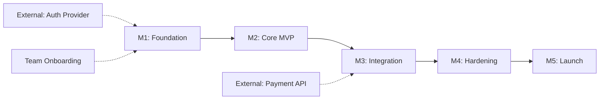

# Project Plan Template

## Full Project Plan Structure

```markdown
# PROJECT PLAN: [Project Name]
**Version**: [X.Y]
**Authors**: [Names]
**Status**: Draft | In Review | Approved
**Date**: YYYY-MM-DD
**Source Requirements**: [Link to approved SRS]
```

---

## 1. Executive Summary

[One-paragraph overview: what is being built, why, for whom, and key timeline]

---

## 2. Scope Summary

### In Scope
[Summarize from SRS — requirements being addressed in this plan]

### Out of Scope
[Explicitly list what this plan does NOT cover]

### Assumptions
[Key assumptions that underpin the plan]

---

## 3. Phase Breakdown

### Phase 1: Foundation
**Duration**: [X weeks]
**Goal**: Establish project infrastructure, CI/CD, core architecture scaffold
**Deliverables**:
- Repository setup with monorepo structure
- CI/CD pipeline (lint → test → build → deploy staging)
- Database schema (initial migration)
- Authentication foundation
- Development environment documentation
**Requirements**: [List FR-XXX items]
**Exit Criteria**: Pipeline green, staging environment operational

### Phase 2: Core MVP
**Duration**: [X weeks]
**Goal**: Implement must-have features end-to-end
**Deliverables**:
- [Core feature 1]
- [Core feature 2]
- Integration tests for core flows
**Requirements**: All MUST-priority items
**Exit Criteria**: All MUST requirements have passing acceptance tests

### Phase 3: Enhancement
**Duration**: [X weeks]
**Goal**: Implement should-have features and integrations
**Deliverables**:
- [Enhancement 1]
- [External integration 1]
- Contract tests for service boundaries
**Requirements**: SHOULD-priority items
**Exit Criteria**: SHOULD requirements passing, integrations verified

### Phase 4: Hardening
**Duration**: [X weeks]
**Goal**: Security hardening, performance optimization, accessibility audit
**Deliverables**:
- Security audit and remediation
- Performance load testing
- Accessibility audit (WCAG 2.2 AA)
- Documentation finalization
**Requirements**: All NFRs
**Exit Criteria**: NFR thresholds met, security scan clean

### Phase 5: Launch
**Duration**: [X weeks]
**Goal**: Production deployment with progressive rollout
**Deliverables**:
- Production environment
- Monitoring and alerting
- Runbooks and on-call rotation
- Launch communication
**Exit Criteria**: SLOs met for 48-hour burn-in period

---

## 4. Milestone Map

| ID | Milestone | Target | Dependencies | Acceptance Criteria |
|----|-----------|--------|-------------|---------------------|
| M1 | Foundation Complete | Week X | None | CI/CD green, staging live |
| M2 | Core MVP Demo | Week Y | M1 | All MUST FRs passing |
| M3 | Integration Complete | Week Z | M2 | Contract tests green |
| M4 | Hardening Complete | Week W | M3 | NFR benchmarks met |
| M5 | Production Launch | Week V | M4 | SLOs met 48h |

---

## 5. Risk Register

### Risk Assessment Matrix

| | **Low Impact** | **Medium Impact** | **High Impact** |
|---|---|---|---|
| **High Probability** | Medium | High | Critical |
| **Medium Probability** | Low | Medium | High |
| **Low Probability** | Low | Low | Medium |

### Identified Risks

#### RISK-001: [Title]
- **Category**: [Technical/Schedule/Resource/External/Security]
- **Probability**: [High/Medium/Low]
- **Impact**: [High/Medium/Low]
- **Risk Score**: [Critical/High/Medium/Low]
- **Description**: [What could go wrong]
- **Mitigation**: [Reduce probability]
- **Contingency**: [If it happens]
- **Owner**: [Who monitors]

### Common Risk Patterns

| Risk Pattern | Typical Category | Mitigation Strategy |
|-------------|-----------------|---------------------|
| Scope creep | Schedule | Feature-flag unreleased work; strict change control |
| Third-party API instability | External | Anti-corruption layer; circuit breakers; contract tests |
| Key person dependency | Resource | Pair programming; documentation; cross-training |
| Performance under load | Technical | Early load testing in Phase 2; budget for optimization |
| Security vulnerability in dependency | Security | Automated `audit` in CI; Dependabot/Renovate |
| Regulatory deadline | External | Hardening phase buffer; compliance-first for affected features |
| Database migration failure | Technical | Reversible migrations; staging rehearsal; backup before migrate |

---

## 6. Dependency Graph



---

## 7. Rollout Strategy Patterns

### Pattern A: Feature-Flag Progressive

```
Deploy with flag OFF
  → Enable for internal team (dogfooding)
  → Enable for 5% of users (canary)
  → Monitor error rates, latency, user feedback for 24h
  → Expand to 25%
  → Monitor for 24h
  → Expand to 50%
  → Monitor for 24h
  → Expand to 100%
  → Remove flag and dead code within 1 sprint
```

### Pattern B: Blue/Green Deployment

```
Deploy new version to "green" environment
  → Run smoke tests against green
  → Switch load balancer to green
  → Monitor for 1 hour
  → If healthy: decommission "blue"
  → If unhealthy: switch back to "blue" (instant rollback)
```

### Pattern C: Canary with Metrics Gates

```
Deploy new version to canary pod (5% traffic)
  → Automated metrics gate:
    - Error rate < baseline + 0.5%
    - p95 latency < baseline + 10%
    - No new crash signatures
  → If gates pass after 30min: expand to 25%
  → If gates fail: automatic rollback
```

---

## 8. Estimation Guidance

### T-Shirt Sizing

| Size | Effort | Complexity | Risk |
|------|--------|-----------|------|
| **XS** | < 1 day | Trivial, well-understood | None |
| **S** | 1-3 days | Simple, minor unknowns | Low |
| **M** | 3-5 days | Moderate complexity | Medium |
| **L** | 1-2 weeks | Significant complexity or unknowns | High |
| **XL** | 2+ weeks | Major effort; consider breaking down | Very high — decompose first |

### Estimation Rules

1. Never estimate an XL item — decompose it into L or smaller first
2. Add 20-30% buffer for integration and unforeseen issues
3. Performance/security hardening takes longer than expected — budget generously
4. First-time integrations with external APIs: double the estimate
5. Include time for: code review, documentation, CI fixes, and test writing
